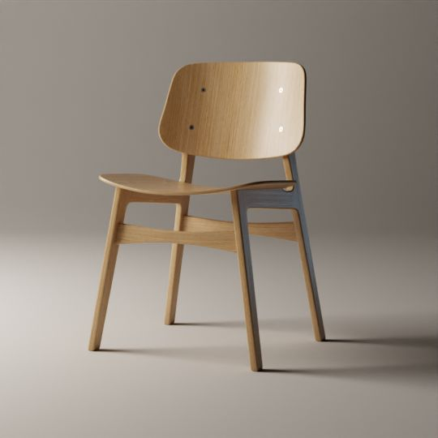

# Blender Modeling Tutorial

A 3D model of [Fredericia's Søborg chair](https://www.fredericia.com/products/by-designer-b%C3%B8rge-mogensen/s%C3%B8borg-wood-base-1.aspx?PID=63&catid=6219) made by following [Blender Guru's "Beginner Modelling Tutorial" on Youtube](https://www.youtube.com/watch?v=Hf2esGA7vCc&list=PLjEaoINr3zgEL9UjPTLWQhLFAK7wVaRMR)

